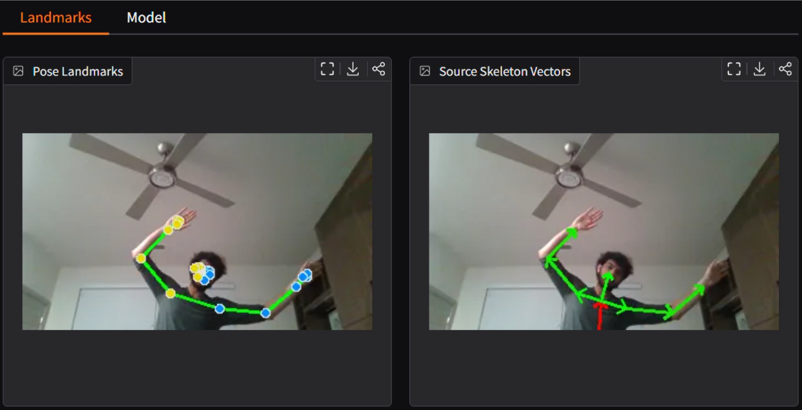
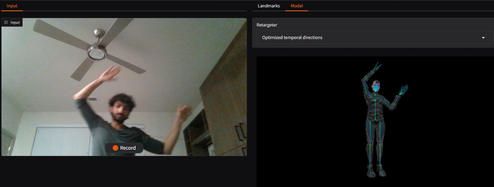

# monocular-pose-retargeting
Webcam-based pose detection and avatar retargeting for CS445 Computational Photography.

This project explores whether motion retargeting can be done with only a standard RGB webcam instead of dedicated motion capture or depth hardware. The demo detects human pose landmarks, converts them into a source skeleton, estimates bone directions, and maps those directions onto a Mixamo-style FBX avatar in real time.

* Github Repo: https://github.com/ZuhairGhias/monocular-pose-retargeting
* Hugging Face Demo: https://huggingface.co/spaces/zghias/monocular-pose-retargeting
* Demo Video: https://youtu.be/IpJfZgiC-fU

## Team

* Zuhair Ghias: Demo setup, pose detection, source skeleton construction, and retargeting pipeline.
* Timothy Gonzalez: Mixamo joint mapping, FBX skeleton mapping, and three.js viewer.
* Dylan Rivas: Optimized temporal direction retargeter, UI/UX, and research.

## Approach

The system starts with MediaPipe pose landmarks from a monocular webcam feed. Those landmarks are converted into a canonical source skeleton with joints, derived joints such as the neck, and bones represented as vectors between joints.

The retargeting layer maps source skeleton bone directions to target bones in the rigged avatar. This lets the avatar preserve its own proportions while following the user's pose. The Gradio interface shows the webcam input, pose landmarks, source skeleton vectors, debug output, and the rendered avatar.



## Retargeting Methods

The demo includes three retargeting strategies:

* Direct source directions: a baseline method that directly maps source bone directions to avatar bones.
* Smoothed source directions: blends current and previous bone directions using pose confidence to reduce jitter.
* Optimized temporal directions: formulates each target bone direction as a small optimization problem balancing current-frame tracking, previous-frame stability, and unit-length direction constraints.



## Results and Limitations

The final demo can drive a rigged avatar from ordinary webcam input and works best when the user's full body is visible. It can follow clear arm, leg, and full-body movements in real time.

The main limitations come from monocular pose estimation. Missing limbs, occlusion, poor framing, or low-confidence landmarks can produce incorrect bone directions and less believable avatar motion. The smoothed and temporal methods reduce jitter, but they do not replace a full-body inverse kinematics or motion capture system.

## Usage

The attached Dockerfile can be used to deploy directly, or the instructions below also work for manual deployment.

To run, you must first install the latest versions of node & python.

First, build a three.js bundle:
```
npm install
npm run build
```

Install the python dependencies:
```
pip install -r requirements.txt
```

The port the app will run on can be set with the env variable `PORT`.

Finally, you should be able to launch the app:
```
python app.py
```

You should see a log output when the server launches:
```
Starting server on http://0.0.0.0:7860...
Open local demo at http://127.0.0.1:7860
```
## Hugging Face Demo

Use this link: https://huggingface.co/spaces/zghias/monocular-pose-retargeting to use the hugging face demo.

Press record to start recording movements, and you will see pose landmarks, source skeleton vectors, and debug output update in real time.

Switch to model view to see the avatar. You can use the retargeter dropdown to change retargeter methods.

## Organization

- `app.py` is the entrypoint into the gradio app
- `rigs` contains the FBX rigs used for rendering
- `models` contains the landmark models
- `src/fbx` contains the fbx rendering component, using three.js
- `src/retargeting` contains retargeting logic
- `src/ui` contains debug panel ui
- `src/*` the rest of src contains pose detection logic

## References

* Google MediaPipe Pose Landmarker: https://ai.google.dev/edge/mediapipe/solutions/vision/pose_landmarker
* Adobe Mixamo: https://www.mixamo.com/
* Gradio Documentation: https://www.gradio.app/docs
* Three.js Documentation: https://threejs.org/docs/
* Yang, Xiaohang, Qing Wang, Jiahao Yang, Gregory Slabaugh, and Shanxin Yuan. "STaR: Seamless Spatial-Temporal Aware Motion Retargeting with Penetration and Consistency Constraints." ICCV, 2025.

## Useful Docs
* https://www.gradio.app/guides/
* https://ai.google.dev/edge/mediapipe/solutions/vision/pose_landmarker/python
